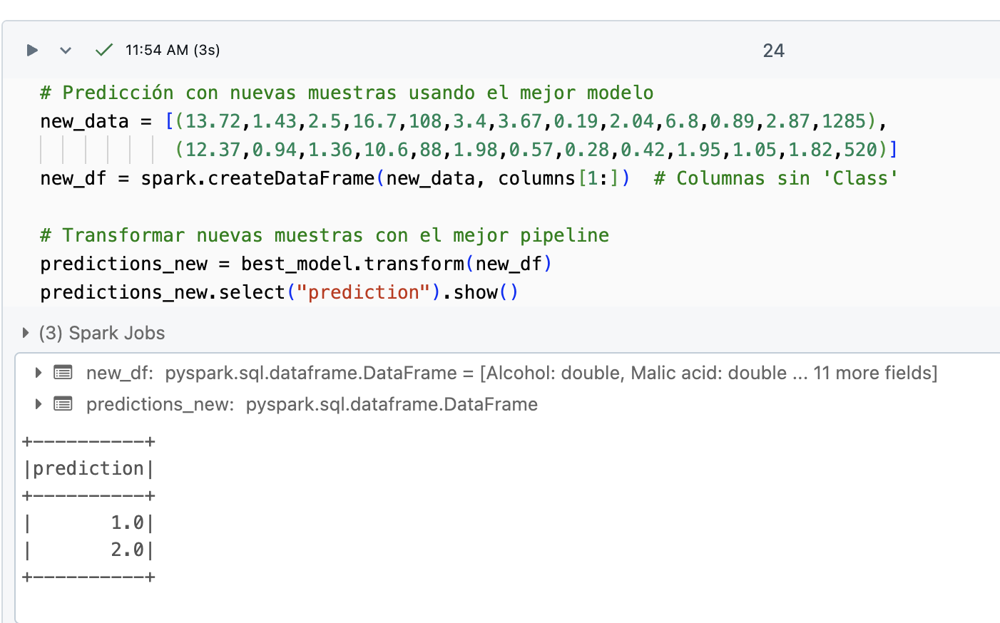
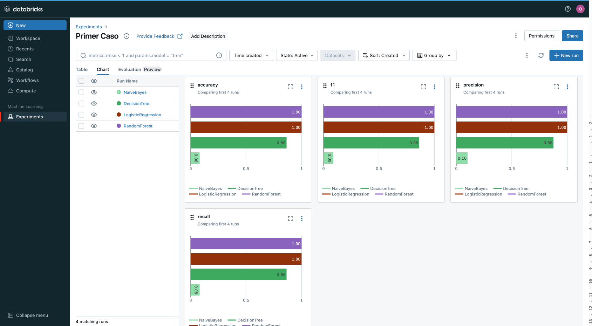

# Clasificación de Vinos usando Machine Learning & MLOps

Este proyecto tiene como objetivo implementar un modelo de clasificación que identifique la variedad de uva de un vino basado en sus características químicas y visuales. El proyecto utiliza **Databricks Community Edition (CE)** para la gestión de experimentos y **MLflow** para el registro y seguimiento de las métricas de evaluación.

EL proyecto puede verse en: 
[Notebook DataBricks Community](https://databricks-prod-cloudfront.cloud.databricks.com/public/4027ec902e239c93eaaa8714f173bcfc/2657414811437463/38460485407947/6411828836102010/latest.html)

## 1. Descripción del Proyecto
Se desarrolló un modelo de Machine Learning para clasificar vinos en tres variedades de uva:
- 0: *Variedad A*
- 1: *Variedad B*
- 2: *Variedad C*

El conjunto de datos utilizado proviene del UCI Machine Learning Repository. El proyecto abarca desde el preprocesamiento de los datos hasta la evaluación de diferentes algoritmos de clasificación para seleccionar el modelo más adecuado.

## 2. Requisitos
### Herramientas Necesarias
- **Databricks Community Edition** : Plataforma para la ejecución y registro de experimentos.
- **MLflow**: Librería utilizada para la gestión y registro de los experimentos.
- **Python**: Lenguaje de programación utilizado para el desarrollo del modelo.
- **Spark**: Utilizado en Databricks para la manipulación y procesamiento de datos a gran escala.

### Conjunto de Datos

- **Datos de Vinos (CSV)** : UCI Wine Dataset
- **Descripción de Variables**: Descripción de Variables
## 3. Instalación y Configuración

- **Paso 1: Crear una Cuenta en Databricks**
    - Regístrate en Databricks Community Edition.
    - Crea y configura un clúster para ejecutar los experimentos.
- **Paso 2: Subir y Configurar el Notebook**
    - Sube el notebook a tu espacio de trabajo en Databricks.
	- Configura MLflow en el notebook para registrar las métricas y los resultados.
## 4. Preprocesamiento de Datos
El preprocesamiento de los datos incluyó los siguientes pasos:
- **Manejo de Datos Faltantes**: Identificación y tratamiento de valores nulos.
- **Tratamiento de Outliers**: Detección y manejo de valores atípicos.
- **Balanceo de Clases**: Verificación y ajuste del balanceo en la variable objetivo.

## 5. Desarrollo y Entrenamiento del Modelo
Se implementaron y evaluaron varios algoritmos de clasificación, incluyendo:
- Regresión Logística
- Support Vector Machines (SVM)
- Random Forest
- Árboles de Decisión

El rendimiento de cada modelo fue evaluado utilizando métricas como precisión, recall, F1-score, y accuracy. Todos los experimentos fueron registrados en Databricks CE utilizando MLflow.

### Selección del Mejor Modelo
Tras evaluar los resultados de los diferentes algoritmos, se seleccionó como el mejor modelo Random Forest basado en su desempeño en las métricas de evaluación.

# 6. Evaluación del Modelo
Los resultados de las métricas se graficaron y analizaron para cada modelo. Se realizaron predicciones sobre dos nuevas muestras de vino:
1.	[13.72, 1.43, 2.5, 16.7, 108, 3.4, 3.67, 0.19, 2.04, 6.8, 0.89, 2.87, 1285]
    - **Predicción**: Variedad X
2.	[12.37, 0.94, 1.36, 10.6, 88, 1.98, 0.57, 0.28, 0.42, 1.95, 1.05, 1.82, 520]
    - **Predicción**: Variedad Y

## 7. Conclusiones
- Desempeño del Modelo: Random Forest demostró ser el más efectivo, con una precisión de 100%.

- Deuda Técnica: Algunos desafíos incluyen la optimización del tiempo de entrenamiento y la mejora en la interpretación de las predicciones.
## 8. Documentación y Evidencias
- Capturas de Pantalla: Se incluyen capturas de pantalla que muestran los resultados y las métricas en Databricks.

# Repositorio de GitHub
Todo el código, capturas de pantalla y documentación del proyecto están disponibles en el siguiente repositorio.

[Github](https://github.com/omarbecerrasierra/MLOpsChallenge/tree/main)
