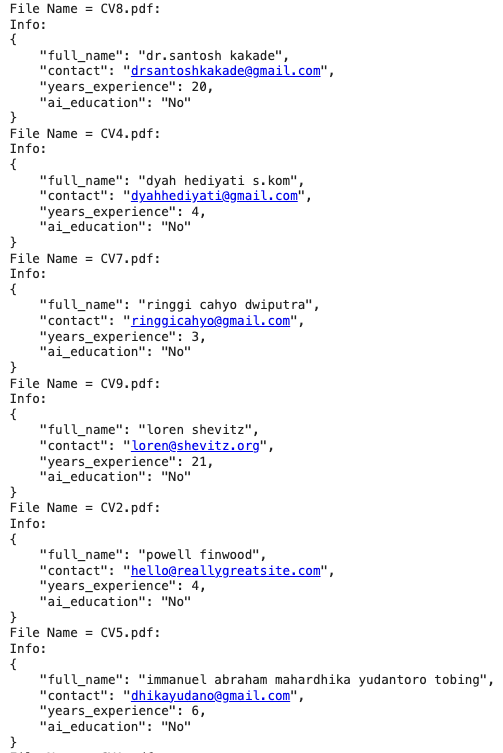
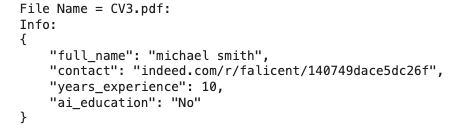

# Extracción de Información de Currículums usando LLM y LangChain

Este proyecto es un prototipo para la extracción automatizada de información específica desde currículums en formato PDF utilizando un modelo de lenguaje grande (LLM) de Google, integrado con la biblioteca LangChain. 

El objetivo principal es procesar una carpeta de archivos PDF, limpiar el texto extraído y luego extraer datos estructurados en formato JSON.

**El proyecto ejecutarse en [Colab](https://colab.research.google.com/drive/1fq_I7EzuXXP3b5FakQVTNe7orEQX9p3f?usp=sharing)**


## 1. Requisitos Previos
Antes de ejecutar este código, asegúrate de tener:
- Python 3.x instalado.
- Google Colab (recomendado para ejecutar este proyecto en la nube).
- Cuenta de Google Cloud con acceso a la API de Google Generative AI.
- Claves de API configuradas para el acceso a los modelos de lenguaje generativo de Google.

## 2. Instalación de Dependencias
Ejecuta los siguientes comandos para instalar las dependencias necesarias:

### Instalación de dependencias necesarias
```python
!pip install -U langchain-core
!pip install -U pymupdf
!pip install -U langchain
!pip install -U langchain-google-genai
```

## 3. Configuración de la API de Google
Para acceder al modelo de lenguaje generativo de Google, debes configurar tu API Key en el entorno:
```python
import os
from google.colab import userdata
os.environ["GOOGLE_API_KEY"] = userdata.get('API_KEY')
```

Asegúrate de haber almacenado tu **API_KEY** en las configuraciones de Google Colab.

## 4. Descripción del Modelo y JSON Resultante
El modelo **Info** define la estructura de los datos que serán extraídos de cada currículum. Incluye campos como el nombre completo, la información de contacto, los años de experiencia y la educación en inteligencia artificial.

```python
class Info(BaseModel):
   full_name: str = Field(description="Full name of the candidate in lower case.")
   contact: str = Field(description="Contact information (email in format lower_case@email.com or phone number in format +(country code) phone number).")
   years_experience: int = Field(description="Total years of professional experience as a number")
   ai_education: str = Field(description="Whether the candidate has education in artificial intelligence. (Options: 'Yes' or 'No')")
```
Ejemplo de JSON Resultante
```json
{
    "full_name": "john doe",
    "contact": "john.doe@example.com",
    "years_experience": 5,
    "ai_education": "Yes"
}
````

## 5. Instrucciones de Ejecución
1. **Carga de Archivos PDF**: Sube los archivos PDF de currículums a Google Colab en una carpeta específica, **dataset/cvs**.
2. **Ejecuta el Código**: Ejecuta las celdas del notebook en orden para procesar los currículums. La función **process_cv_folder** recorrerá todos los archivos en la carpeta especificada y generará un JSON por cada archivo.
3. **Revisión de Resultados**: Los resultados se mostrarán en el notebook y estarán disponibles para descarga en formato JSON.

### Capturas de Pantalla




## 7. Errores y Deuda Técnica
Durante el desarrollo, se encontraron algunos desafíos:
- **Extracción Incompleta de Datos**: En algunos casos, el modelo no pudo extraer ciertos campos, resultando en datos erróneos (en este caso el contact no es **email** ni **telefono**).



- **Deuda Técnica**: El prototipo actual no incluye un cálculo detallado del score. En futuras versiones, se podría implementar un mecanismo de evaluación más sofisticado.

## 8. Conclusión
Este prototipo demuestra el potencial de utilizar LLMs para la extracción de información estructurada desde currículums en PDF. Aunque se han identificado áreas de mejora, el enfoque y la implementación proporcionan una base sólida para futuras iteraciones.
